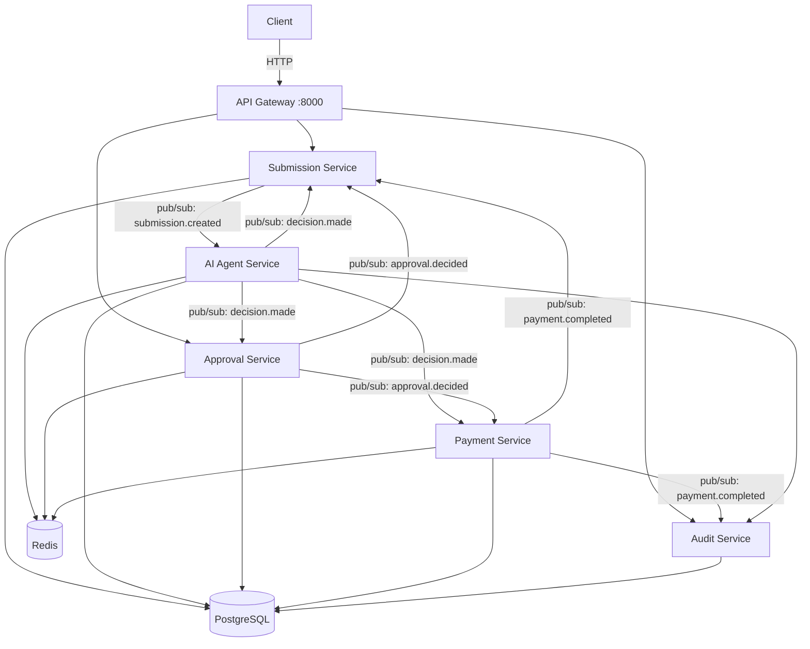

# ApprovalFlow

> AI-assisted invoice & expense approval platform for large enterprises.

## What it does

ApprovalFlow is a microservice-based SaaS platform that ingests expense invoices, uses an AI agent to evaluate each item against company policy, and automatically approves the routine 80% of submissions — routing the risky 20% to human reviewers. Every decision is auditable, and the AI is provably incapable of auto-approving anything above the configured spending ceiling.

## System Diagram



## Technologies

| Component | Technology |
|---|---|
| Services | Python 3.11 + FastAPI |
| Communication | Dapr (pub/sub + service invocation) |
| Message broker | Redis Streams |
| State store | Redis (Dapr) |
| Database | PostgreSQL (5 schemas) |
| AI Agent | LiteLLM (provider-agnostic) |
| API Gateway | Nginx (rate-limiting) |
| UI | React + Vite + Tailwind CSS |
| CI | GitHub Actions |

## How to Run

### Prerequisites

- Docker Desktop
- Docker Compose v2
- Python 3.11 (for the verification script)

### Start the system

```bash
cp .env.example .env
# Edit .env and add your LLM_API_KEY

docker compose up -d --wait
```

Open [http://localhost:3000](http://localhost:3000)

### Environment variables

| Variable | Description | Default |
|---|---|---|
| `LLM_API_KEY` | API key for the LLM provider | required |
| `LLM_PROVIDER` | LLM provider model string | `gemini/gemini-1.5-flash` |
| `LLM_MOCK` | Mock mode — no real API calls | `false` |
| `PAYMENT_FAILURE_INJECT` | Force payment failure (testing) | `""` |

## How to Test

### Unit tests (offline)

```bash
pytest services/*/tests -v
```

### End-to-end verification (4 journeys + guards)

```bash
docker compose up -d --wait
python scripts/verify.py
```

### Concurrent load test (N1 / M6)

```bash
python scripts/load_test.py          # 10 concurrent submissions
python scripts/load_test.py --n 25   # triggers Nginx rate-limiter (burst=20)
```

Validates: no 5xx under concurrency, rate-limiter fires at burst > 20, no duplicate tracking_ids.

Expected output:

```
✅ ALL CHECKS PASSED — system is verified (33/33)
```

### The 4 journeys

| Journey | Fixture | Expected outcome |
|---|---|---|
| Auto-approve | INV-1001 — $42 meal | `status=PAID`, no human touch |
| Escalate & resume | INV-1003 — $1,820 client dinner | `ESCALATED` → `PAID` after human approval |
| Duplicate | INV-1007 — re-submit same invoice | Same `tracking_id` returned, paid once |
| Payment failure | INV-1012 — $9,500 hardware | `PAYMENT_FAILED`, budget fully restored |

## API Reference (OpenAPI / Swagger)

FastAPI generates interactive API docs automatically. With the system running:

| Service | Swagger UI | Port |
|---|---|---|
| Submission Service | http://localhost:8001/docs | 8001 |
| AI Agent Service | http://localhost:8002/docs | 8002 |
| Approval Service | http://localhost:8003/docs | 8003 |
| Payment Service | http://localhost:8004/docs | 8004 |
| Audit Service | http://localhost:8005/docs | 8005 |

> The API Gateway (port 8000) proxies `/submissions`, `/approvals`, and `/audit` routes.
> Individual service `/docs` endpoints are accessible directly for development.

## Architecture Decisions

See [`docs/adr/`](docs/adr/) for all key decisions:

- **ADR-001** — Python + FastAPI over TypeScript
- **ADR-002** — Choreography-based saga (no central orchestrator)
- **ADR-003** — Autonomy ceiling $250 + confidence 0.80
- **ADR-004** — Server-side content-hash idempotency key
- **ADR-005** — Dapr state store for durable HITL pause/resume
- **ADR-006** — Shared PostgreSQL with separate schemas
- **ADR-007** — Nginx API gateway
- **ADR-008** — RAG over policy (semantic search, N5)

## Autonomy Posture

See [`docs/PRODUCT-DILEMMA.md`](docs/PRODUCT-DILEMMA.md) for full justification.

- **Ceiling:** $250 per item
- **Confidence threshold:** 0.80
- **Hard stops:** unknown vendor, math mismatch, missing receipt, fraud signals, FX > $1,000, first-class travel

The ceiling is enforced in deterministic code — the LLM advisory layer never writes to the `amount_usd` field that the router reads.

## Proof of Ceiling (M12 / F10)

```bash
curl http://localhost:8000/audit/prove-ceiling
# → {"violation_found": false, "ceiling": 250, "checked": N}
```

## What I Would Do With Another Week

**N1 — JWT Authentication:**
Add a `python-jose` middleware layer in the API Gateway (or per-service) that validates
RS256 tokens. The `submitted_by` and `decided_by` fields are already propagated through
the event chain — connecting them to a real identity provider (e.g., Auth0) would be
straightforward. Estimated: 1 day.

**N4 — OpenTelemetry end-to-end trace:**
Instrument every FastAPI service with `opentelemetry-sdk` + `opentelemetry-instrumentation-fastapi`.
A single `trace_id` would flow from the Gateway through pub/sub to every service,
making the choreography flow visible in a Jaeger or Grafana Tempo dashboard.
`correlation_id` is already threaded through every event — it would become the OTel trace ID.
Estimated: 1.5 days.

**RAG quality improvement (N5 follow-up):**
Replace the current pure-vector search with a hybrid BM25 + vector approach using
Reciprocal Rank Fusion. The current model (all-MiniLM-L6-v2) misses MEAL-03 for
informal queries like "happy hour beverages" — hybrid search would fix this without
retraining. Estimated: 0.5 days. See [ADR-008](docs/adr/ADR-008.md) for full analysis.

**Better department budget enforcement (M13):**
The current budget check uses Dapr state with CAS (optimistic locking), which is correct
but not tested under real concurrent load. Adding a chaos test (inject concurrent approvals
for the same department simultaneously) would prove the CAS holds under race conditions.
Estimated: 0.5 days.
