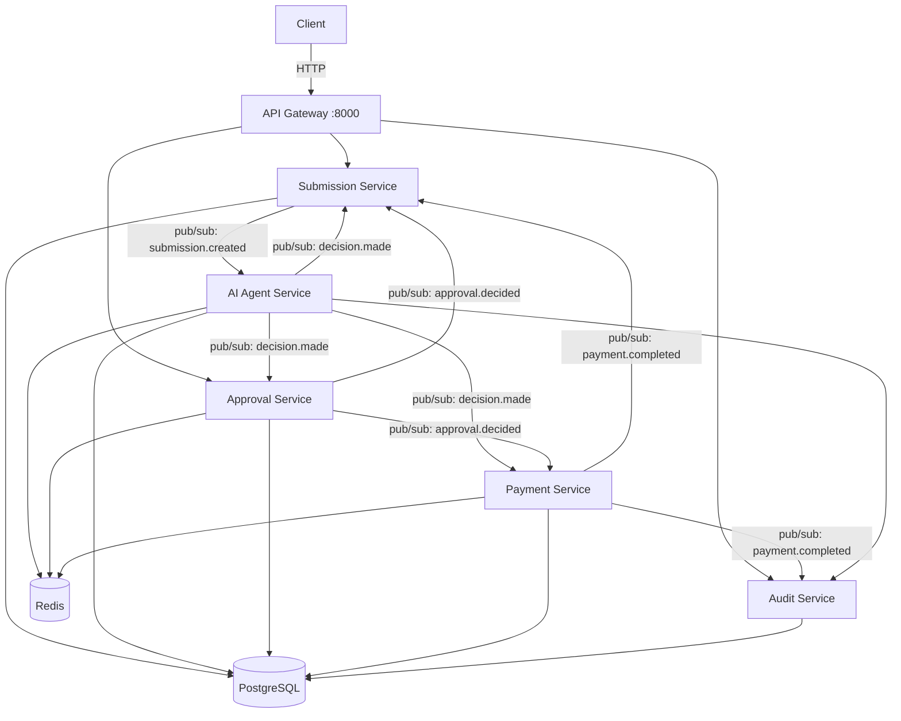

# ApprovalFlow

> AI-assisted invoice & expense approval platform for large enterprises.

## What it does

ApprovalFlow is a microservice-based SaaS platform that ingests expense invoices, uses an AI agent to evaluate each item against company policy, and automatically approves the routine 80% of submissions — routing the risky 20% to human reviewers. Every decision is auditable, and the AI is provably incapable of auto-approving anything above the configured spending ceiling.

## System Diagram



## Technologies

| Component | Technology |
|---|---|
| Services | Python 3.11 + FastAPI |
| Communication | Dapr (pub/sub + service invocation) |
| Message broker | Redis Streams |
| State store | Redis (Dapr) |
| Database | PostgreSQL (5 schemas) |
| AI Agent | LiteLLM (provider-agnostic) |
| API Gateway | Nginx (rate-limiting) |
| UI | React + Vite + Tailwind CSS |
| CI | GitHub Actions |
| CD | GitHub Container Registry (GHCR) — auto-publish on green CI |

## How to Run

### Prerequisites

- Docker Desktop
- Docker Compose v2
- Python 3.11 (for the verification script)

### Start the system

```bash
cp .env.example .env
# Edit .env and add your LLM_API_KEY

docker compose up -d --wait
```

Open [http://localhost:3000](http://localhost:3000)

### Environment variables

| Variable | Description | Default |
|---|---|---|
| `LLM_API_KEY` | API key for the LLM provider | required |
| `LLM_PROVIDER` | LLM provider model string | `gemini/gemini-1.5-flash` |
| `LLM_MOCK` | Mock mode — no real API calls | `false` |
| `PAYMENT_FAILURE_INJECT` | Force payment failure (testing) | `""` |

## How to Test

### Unit tests (offline)

```bash
pytest services/*/tests -v
```

### End-to-end verification (4 journeys + guards)

```bash
docker compose up -d --wait
python scripts/verify.py
```

Expected output:

```
✅ ALL CHECKS PASSED — system is verified (33/33)
```

### Integration tests (requires docker compose up)

```bash
docker compose up -d --wait
pytest tests/integration -v -m integration
```

Tests real service behaviour against live containers — submission intake,
pub/sub event flow, and duplicate detection.

### E2E tests (requires docker compose up)

```bash
docker compose up -d --wait
pytest tests/e2e -v -m e2e
```

Tests full journeys end-to-end through the API gateway:
auto-approve flow, audit trail completeness, ceiling proof,
and the adversarial-note anti-cheese guard.

### Eval harness — all 19 fixtures (B1)

```bash
docker compose up -d --wait
python scripts/eval.py
```

Runs every labeled fixture from `sample-invoices.json` against the live system,
compares actual routing decisions against `expected.route`, and prints an
accuracy report. Saves a machine-readable report to `docs/eval-report.json`.

### The 4 journeys

| Journey | Fixture | Expected outcome |
|---|---|---|
| Auto-approve | INV-1001 — $42 meal | `status=PAID`, no human touch |
| Escalate & resume | INV-1003 — $1,820 client dinner | `ESCALATED` → `PAID` after human approval |
| Duplicate | INV-1007 — re-submit same invoice | Same `tracking_id` returned, paid once |
| Payment failure | INV-1012 — $9,500 hardware | `PAYMENT_FAILED`, budget fully restored |

## API Documentation

FastAPI generates interactive OpenAPI docs automatically. With the system running:

| Service | Swagger UI | Port |
|---|---|---|
| Submission | http://localhost:8001/docs | 8001 |
| AI Agent | http://localhost:8002/docs | 8002 |
| Approval | http://localhost:8003/docs | 8003 |
| Payment | http://localhost:8004/docs | 8004 |
| Audit | http://localhost:8005/docs | 8005 |

All external requests route through the API Gateway (`http://localhost:8000`) — see full routing in [`services/api-gateway/nginx.conf`](services/api-gateway/nginx.conf).
The individual `/docs` endpoints are accessible directly for development and are not exposed through the gateway in production.

### Concurrent load test (rate-limiting + budget CAS)

```bash
python scripts/load_test.py
```

Sends 30 parallel requests to verify Nginx rate-limiting fires (returns 503 by default; add `limit_req_status 429;` to nginx.conf for 429), then runs 5 concurrent $600 submissions against a $1,000 department budget to exercise the Dapr CAS lock (M6 + M13).

## Authentication

JWT verification is enforced at the Nginx API Gateway layer — services themselves stay stateless and role-unaware.

| Role | Username | Password | Access |
|---|---|---|---|
| Submitter | dana | pass123 | submit + status only |
| Approver | lena | pass123 | submit + approve/reject/request-info |
| Admin | admin | admin123 | full access |

### Get a token

```bash
curl -X POST http://localhost:8000/auth/token \
  -H "Content-Type: application/json" \
  -d '{"username":"lena","password":"pass123","role":"approver"}'
# → {"access_token":"<jwt>","token_type":"bearer"}
```

### Use the token

```bash
curl -X POST http://localhost:8000/approvals/<id>/decide \
  -H "Authorization: Bearer <token>" \
  -H "Content-Type: application/json" \
  -d '{"action":"APPROVE","decided_by":"lena","notes":"Approved"}'
```

Protected endpoints (approver or admin only):
- `POST /approvals/{id}/decide`

Open endpoints (no auth required):
- `POST /submissions`, `GET /submissions/{id}`, `GET /approvals/queue`, `GET /audit/*`, `GET /health`

## Architecture Decisions

See [`docs/adr/`](docs/adr/) for all key decisions:

- **ADR-001** — Python + FastAPI over TypeScript
- **ADR-002** — Choreography-based saga (no central orchestrator)
- **ADR-003** — Autonomy ceiling $250 + confidence 0.80
- **ADR-004** — Server-side content-hash idempotency key
- **ADR-005** — Dapr state store for durable HITL pause/resume
- **ADR-006** — Shared PostgreSQL with separate schemas
- **ADR-007** — Nginx API gateway
- **ADR-008** — Hybrid BM25 + vector policy retrieval
- **ADR-009** — JWT authentication at the gateway (not in services)

## Autonomy Posture

See [`docs/PRODUCT-DILEMMA.md`](docs/PRODUCT-DILEMMA.md) for full justification.

- **Ceiling:** $250 per item
- **Confidence threshold:** 0.80
- **Hard stops:** unknown vendor, math mismatch, missing receipt, fraud signals, FX > $1,000, first-class travel

The ceiling is enforced in deterministic code — the LLM advisory layer never writes to the `amount_usd` field that the router reads.

## Proof of Ceiling (M12 / F10)

```bash
curl http://localhost:8000/audit/prove-ceiling
# → {"violation_found": false, "ceiling": 250, "checked": N}
```

## What I'd Do With More Time

Given another week, I'd prioritize three things, roughly in this order:

**1. Saga observability.** The choreography-based saga (ADR-002) is
clean architecturally but opaque operationally — if a submission
gets stuck, there's no single place that shows "payment is waiting
on approval, which is waiting on X." I'd add a state-machine view to
the audit service, keyed by correlation_id, so the full saga state
is visible at a glance instead of reconstructed by hand from events.

**2. OpenTelemetry distributed tracing.** Now that auth is in place
and every request has an identity attached, distributed traces become
genuinely useful — you can correlate a latency spike to a specific
user, service hop, or LLM call. Without auth, traces are anonymous
and much harder to act on.

**3. RAG reranking.** The current hybrid BM25 + vector fusion uses a
fixed 0.5/0.5 weight. A lightweight cross-encoder reranker on the
top-10 candidates would improve precision further, especially for
multi-keyword policy queries where the fusion weights are a rough
heuristic.

**What's already shipped:** hybrid RAG (BM25 + vector, ADR-008),
JWT authentication at the Nginx gateway (ADR-009), eval harness
with 100% accuracy on all 19 fixtures (B1), and CD to GHCR (N2).
