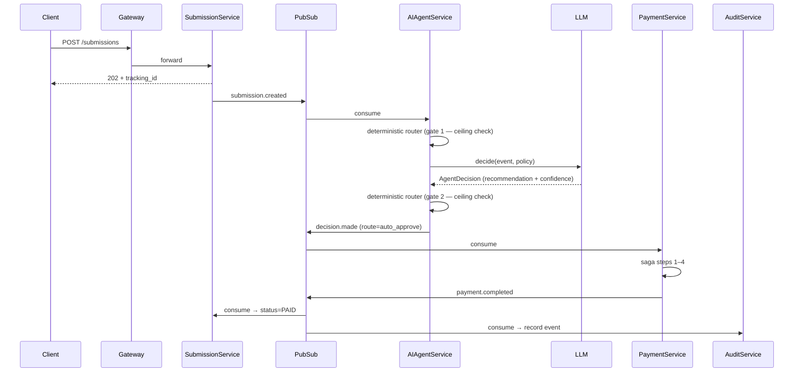
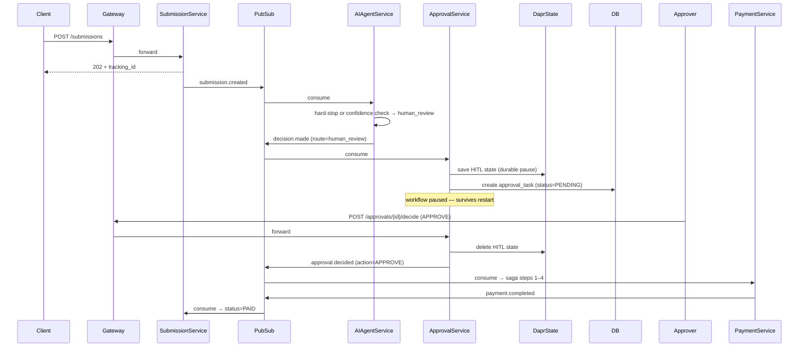
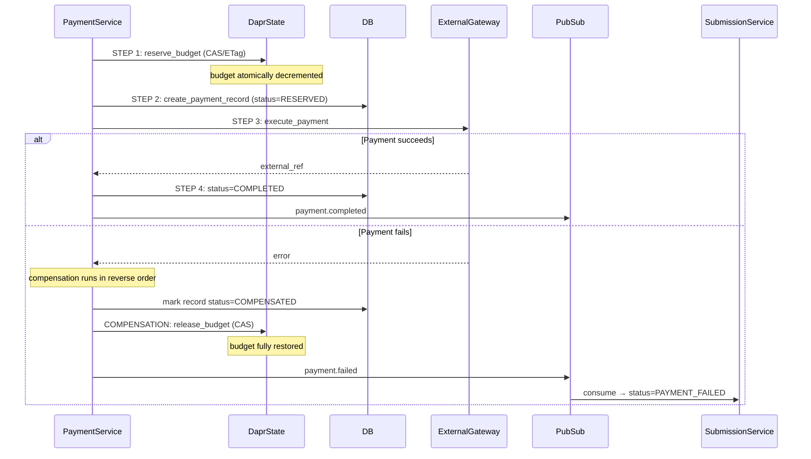

# ApprovalFlow — Architecture

## Service Overview

| Service | Responsibility | Port |
|---|---|---|
| api-gateway | Single external entry point, rate-limiting (Nginx) | 8000 |
| submission-service | Invoice intake, idempotency, FX conversion, status tracking | 8001 |
| ai-agent-service | LLM evaluation + deterministic router | 8002 |
| approval-service | Human-in-the-loop queue, durable pause/resume | 8003 |
| payment-service | Budget reservation, payment execution, saga compensation | 8004 |
| audit-service | Append-only event log, dashboard, ceiling proof | 8005 |

## Communication Patterns

| Pattern | Used for |
|---|---|
| **Dapr pub/sub** (async) | All cross-service event flow: `submission.created` → `decision.made` → `approval.decided` → `payment.completed` / `payment.failed` |
| **Dapr service invocation** (sync) | ai-agent-service → submission-service to update submission status |
| **Dapr state store** (Redis) | HITL durable pause state; department budget with CAS/ETag |

---

## Sequence Diagram 1 — Auto-Approve Flow

---

## Sequence Diagram 2 — Escalate-and-Resume Flow

---

## Sequence Diagram 3 — Payment Saga with Compensation

---

## M12 — Ceiling Enforcement (Two-Gate Proof)

The AI agent is **provably incapable** of auto-approving above the configured ceiling ($250).

**Gate 1** — runs *before* the LLM call, inside `_check_autonomy_ceiling()` in `router.py`. If `amount_usd > ceiling`, the router immediately returns `human_review` without calling the LLM at all.

**Gate 2** — runs *after* the LLM call. Even if Gate 1 were somehow bypassed, the router re-reads `amount_usd` (a `Decimal` field set at intake by submission-service — never written by the LLM) and returns `human_review` if the ceiling is exceeded.

The LLM writes only to `recommendation`, `confidence`, `reasoning`, and `policy_violations`. It never writes to `amount_usd`. The router's routing decision reads only `amount_usd`.

Verification: `GET /audit/prove-ceiling` scans every `decision.made` event in the audit log and returns `violation_found: false` if the ceiling held for every auto-approved record.
